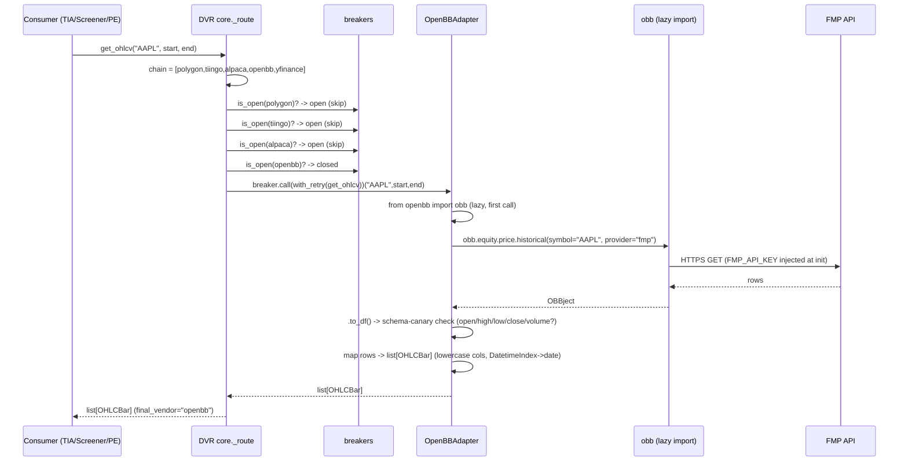

# Design (HLD + LLD): OpenBB Platform as DVR Data Provider

**Feature slug:** openbb-data-layer
**Phase:** 2 — High-Level + Low-Level Design
**Author:** architect-agent
**Date:** 2026-06-30
**Spec:** `specs/openbb-data-layer/spec.md` (signed off — scope fixed, not re-opened)
**Gap analysis:** `specs/openbb-data-layer/gap-analysis.md`
**Templates referenced:** `specs/_templates/HLD_TEMPLATE.md`, `specs/_templates/LLD_TEMPLATE.md`
**Repo / branch:** `data-vendor-router` @ `feature/openbb-data-layer` (off `development @ 61e4858`)

> **Sizing note (right-sized per SDLC §design):** This is a GREEN, reuse-heavy,
> single-repo, additive change — one new adapter file + 5 small edits, mirroring
> the existing `polygon.py` adapter. No new service, no changed boundary, no new
> cross-cutting pattern, no external-dependency *swap* (OpenBB is an *added*
> fallback, not a replacement). Therefore: **inline Solution Options note (below),
> no weighted decision matrix, no ADR.** The one item that would normally trigger
> an ADR — adding an external dependency (`openbb-core`) — is mitigated to
> "note-only" because it is an **optional extra** (`[openbb]`) that silent-skips
> when absent (NFR-4) and is version-pinned with a schema canary (NFR-3). A
> doc-drift sweep on the implementing PR is still required (README vendor list +
> chain docstring); see "Required for Phase-2 sign-off".

---

## 1. Solution Options Analysis (inline, right-sized)

The spec and gap-analysis fix the *shape* of the solution (one adapter behind the
existing Protocol). Within that, the only real design choice is **how OpenBB is
integrated as a dependency and invoked**. Three candidates were considered:

**Option A — Thin adapter wrapping the `openbb` SDK, lazy-imported inside methods, registered as DVR vendor slot-4 (CHOSEN).**
- *Fit / long-term architecture:* Perfect fit. DVR is purpose-built for this exact
  extension pattern (Protocol + registry + breaker + retry + chain). OpenBB becomes
  one more interchangeable vendor; the boundary (`OHLCVProvider`/`FundamentalsProvider`
  Protocol) is unchanged. Every consumer (TIA, ScreenerService, PE, precompute,
  newsservice) benefits with zero code change. This is the architecturally aligned
  choice: it preserves the single chokepoint (DVR) for all market data.
- *Cons:* Couples us to OpenBB's `OBBject.to_df()` column contract → mitigated by the
  schema canary (NFR-3) + version pin.

**Option B — Call FMP / Polygon / SEC HTTP APIs directly (skip the OpenBB SDK), as separate adapters.**
- *Pros:* No heavy SDK dependency (~50–100 MB); matches the existing `polygon.py`
  httpx style exactly; smallest cold-start.
- *Cons:* **Defeats the feature's entire point.** The owner greenlit OpenBB
  *specifically* as a unified, free, MIT pipe (SEC EDGAR + FRED + multi-provider
  normalization) so we don't hand-roll N vendor clients. Rebuilding SEC/FRED/FMP
  parsing ourselves is more long-term maintenance, not less. Rejected — contradicts
  the approved spec intent.

**Option C — OpenBB as a standalone microservice (FastAPI sidecar) the DVR calls over HTTP.**
- *Pros:* Isolates the heavy SDK + its transitive deps from consumer venvs; one
  install point.
- *Cons:* New service = new boundary, new deploy unit, new failure mode, network hop,
  ops burden — explicitly *out of scope* and massively over-engineered for a fallback
  data source. Violates "no rip-and-replace / contained / one branch." Rejected.

**Decision:** **Option A.** It is the only option that honors the approved scope and
the existing DVR architecture, adds zero new boundaries, and keeps OpenBB swappable.
The SDK-weight/cold-start risk is the one real tradeoff vs Option B, and it is bought
down by **lazy import inside methods** (NFR-1) and the **optional `[openbb]` extra**
(NFR-4) — base installs are completely unaffected.

---

## 2. Component Map

| Component | New/Changed | Responsibility |
|---|---|---|
| `vendors/openbb.py` → `OpenBBAdapter` | **NEW** | Implements `get_ohlcv` + `get_fundamentals` (P1), `get_macro` + `get_news` (P2). Injects creds at init, lazy-imports `obb`, translates OpenBB/network errors → DVR internal exceptions, maps `OBBject.to_df()` → DTOs, schema-canary guard. Self-registers `register_adapter("openbb", OpenBBAdapter())`. |
| `vendors/__init__.py` `_BUILTIN_ADAPTER_MODULES` | EDIT (1 line) | Append `"openbb"` so `register_all_available()` auto-imports it (silent-skip if SDK absent). |
| `chains.py` `DEFAULT_CHAINS` | EDIT (2 lines) | Insert `"openbb"` at OHLCV slot-4 (before `yfinance`) and append to fundamentals chain (after `polygon`). |
| `retry.py` `RETRY_ON_TRANSIENT_VENDORS` | EDIT (1 line) | Add `"openbb"` so transient network hiccups get one retry. |
| `pyproject.toml` `[project.optional-dependencies]` | EDIT | Add `[openbb]` extras group, pinned. |
| `tests/test_vendor_openbb.py` | **NEW** | Unit tests with mocked `obb`. |
| `core.py`, `breakers.py`, `dto.py`, `exceptions.py`, `observability.py` | **UNCHANGED** | Router loop, breaker, DTOs, exception types, instrumentation auto-apply to `"openbb"` once registered. (out-of-scope guardrail) |

### Placement in the OHLCV chain
```
get_ohlcv(AAPL)
  → polygon → tiingo → alpaca → [openbb] → yfinance(dead on VPS)
                                   │
                                   └── OpenBBAdapter.get_ohlcv:
                                         obb.equity.price.historical(provider="fmp")
                                         └─fail→ provider="polygon"
```
On the VPS, polygon/tiingo/alpaca may breaker-open and yfinance is IP-blocked, so
**openbb is the real last working OHLCV source** (US-7 / AC-7.x).

### Service boundaries
DVR remains the single owner of all market-data fetch + fallback. **No new service.**
No consumer-service code changes (gap-analysis §3: all five consumers already call
the DVR public API and handle `AllVendorsFailed`).

---

## 3. Sequence Diagram — `get_ohlcv` falls through to openbb→fmp


If `provider="fmp"` raises inside the adapter, the adapter retries with
`provider="polygon"` **internally** (EC-2: a single DVR exception is raised only if
*both* fail).

---

## 4. Low-Level Design — `vendors/openbb.py`

### 4.1 Module skeleton (mirrors `polygon.py`)
```python
"""OpenBB Platform adapter — OHLCV + Fundamentals (P1), Macro + News (P2).

Free MIT SDK. OHLCV via FMP/Polygon keys we hold; fundamentals via SEC EDGAR (free).
Credentials injected from env (NO ~/.openbb_platform/user_settings.json — VPS headless).
`obb` is lazy-imported inside methods (NFR-1 cold-start). Module import is guarded so
register_all_available() silent-skips when the [openbb] extras are absent (NFR-4 / US-4).
"""
from __future__ import annotations
import os
from datetime import date

from ..dto import FundamentalsSnapshot, OHLCBar          # + MacroDataPoint, NewsItem (P2)
from ..exceptions import (
    VendorResponseInvalid, _NetworkError, _NotFoundError,
    _RateLimitError, _ServerError,
)
from . import register_adapter

VENDOR = "openbb"
_EXPECTED_OHLC_COLS = {"open", "high", "low", "close", "volume"}   # schema canary (NFR-3)

# Module-level guard: if openbb-core is NOT installed, raise ImportError so
# register_all_available() skips this module silently (matches existing pattern).
try:
    import openbb  # noqa: F401  (presence probe only; real obj lazy-imported per call)
except ImportError:  # pragma: no cover
    raise  # re-raise -> register_all_available() catches ImportError and skips
```
> **AC-4.1 nuance (flag):** the spec wording says `get_adapter("openbb")` raises
> `KeyError` when absent. The actual registry (`vendors/__init__.py:48`) raises
> **`ValueError`**. The adapter is correct as written; the test must assert
> `ValueError` (or `is_registered("openbb") is False`). Logged here so the
> implementer does not "fix" the registry to match stale AC text. Recommend a
> 1-word AC errata (KeyError→ValueError) at sign-off — no code change.

### 4.2 `__init__` — credential injection (US-2 / REQ-OBB-06 / AC-2.1–2.3 / EC-3)
```python
class OpenBBAdapter:
    name = VENDOR

    def __init__(self) -> None:
        # Inject creds ONCE at init (thread-safe re: EC-3 — never mutated per call).
        from openbb import obb
        for cred_attr, env_var in (
            ("fmp_api_key",     "FMP_API_KEY"),
            ("polygon_api_key", "POLYGON_API_KEY"),
            ("fred_api_key",    "FRED_API_KEY"),
        ):
            val = os.getenv(env_var)
            if val:                                  # AC-2.2: unset env -> no error, skip
                setattr(obb.user.credentials, cred_attr, val)
```
Notes: credentials set only when env var present (AC-2.2). No home-dir file read
(AC-2.3). Importing `obb` in `__init__` is acceptable for NFR-1 because the adapter
is instantiated at *registration* time, which is import time — but per AC-1.9 the
**heavy historical/fundamental call paths must not import obb at module top-level**;
the module-level probe above is `import openbb` (cheap namespace), and the real
`from openbb import obb` happens in `__init__`/methods, not at module scope. *(If
profiling on VPS shows `__init__`-time `obb` import breaches the 200 ms NFR-1 budget,
move the cred injection to a lazily-memoized `_ensure_creds()` called at the top of
each method — note left for the implementer; default is init-time.)*

### 4.3 `get_ohlcv` (US-1 / REQ-OBB-07 / AC-1.4–1.8 / EC-1, EC-2, EC-6)
```python
    def get_ohlcv(self, ticker: str, start: date, end: date) -> list[OHLCBar]:
        from openbb import obb
        last_exc = None
        for provider in ("fmp", "polygon"):          # spec: fmp then polygon
            try:
                obbject = obb.equity.price.historical(
                    symbol=ticker,                    # EC-6: pass as-is, no reformat
                    start_date=start.isoformat(),
                    end_date=end.isoformat(),
                    provider=provider,
                )
                return self._obbject_to_bars(obbject, ticker)
            except (_NotFoundError, VendorResponseInvalid):
                raise                                 # terminal — don't try next provider
            except Exception as exc:                  # noqa: BLE001
                last_exc = self._translate(exc, ticker)
                if isinstance(last_exc, _NotFoundError):
                    raise last_exc
                continue                              # EC-2: try polygon
        raise last_exc or _NetworkError(f"openbb: both providers failed for {ticker}")
```

### 4.4 `_obbject_to_bars` — OBBject → list[OHLCBar] + schema canary
```python
    def _obbject_to_bars(self, obbject, ticker: str) -> list[OHLCBar]:
        try:
            df = obbject.to_df()
        except Exception as exc:                      # noqa: BLE001
            raise _ServerError(f"openbb to_df failed: {exc}") from exc
        if df is None or df.empty:
            raise _NotFoundError(f"openbb returned no OHLCV for {ticker}")   # AC-1.7 / EC-1
        cols = {c.lower() for c in df.columns}
        if not _EXPECTED_OHLC_COLS.issubset(cols):    # AC-1.8 / NFR-3 / EC-5 schema canary
            raise VendorResponseInvalid(
                f"openbb OHLC schema drift: have {sorted(cols)}",
                vendor=VENDOR, raw_response=sorted(cols),
                validation_errors=[{"msg": "missing OHLC columns"}],
            )
        df = df.rename(columns=str.lower)
        bars: list[OHLCBar] = []
        for idx, row in df.iterrows():                # idx = DatetimeIndex -> date
            try:
                bar_date = idx.date() if hasattr(idx, "date") else date.fromisoformat(str(idx)[:10])
                bars.append(OHLCBar(
                    date=bar_date,
                    open=float(row["open"]), high=float(row["high"]),
                    low=float(row["low"]),  close=float(row["close"]),
                    volume=int(row["volume"]),
                ))
            except Exception as exc:                  # noqa: BLE001
                raise VendorResponseInvalid(
                    f"openbb bar validation failed: {exc}",
                    vendor=VENDOR, raw_response=str(row)[:500],
                    validation_errors=[{"msg": str(exc)}],
                ) from exc
        return bars
```
Column map: `open→open, high→high, low→low, close→close, volume→volume` (OpenBB emits
lowercase; `str.lower` defends against a casing change). Index (`DatetimeIndex`) →
`OHLCBar.date`.

### 4.5 `get_fundamentals` (US-5 / REQ-OBB-08 / AC-5.1–5.3 / EC-7)
```python
    def get_fundamentals(self, ticker: str) -> FundamentalsSnapshot:
        from openbb import obb
        last_exc = None
        for provider in ("sec", "fmp"):               # spec: sec(free) then fmp
            try:
                obbject = obb.equity.fundamental.metrics(symbol=ticker, provider=provider)
                df = obbject.to_df()
                if df is None or df.empty:
                    raise _NotFoundError(f"openbb no fundamentals for {ticker}")  # AC-5.2/EC-7
                rec = df.iloc[0].to_dict()
                return FundamentalsSnapshot(
                    ticker=ticker.upper(),
                    market_cap=rec.get("market_cap"),
                    pe=rec.get("pe_ratio") or rec.get("pe"),
                    dividend_yield=rec.get("dividend_yield"),
                    profit_margin=rec.get("net_profit_margin") or rec.get("profit_margin"),
                    revenue_ttm=rec.get("revenue"),
                    sector=rec.get("sector"),
                    extras={"openbb": rec},            # AC-5.3: extras absorb vendor fields
                )
            except (_NotFoundError, VendorResponseInvalid):
                raise
            except Exception as exc:                  # noqa: BLE001
                last_exc = self._translate(exc, ticker); continue
        raise last_exc or _NotFoundError(f"openbb fundamentals unavailable for {ticker}")
```

### 4.6 Exception translation (`_translate`) — REQ-OBB-10 / AC-1.5, AC-1.6
```python
    @staticmethod
    def _translate(exc: Exception, ticker: str) -> Exception:
        name = type(exc).__name__.lower()
        msg  = str(exc).lower()
        if "429" in msg or "rate" in msg and "limit" in msg or "ratelimit" in name:
            return _RateLimitError(f"openbb rate-limited: {exc}")
        if any(k in msg for k in ("404", "not found", "no data", "empty")):
            return _NotFoundError(f"openbb not found for {ticker}: {exc}")
        if any(k in msg for k in ("timeout", "connection", "network", "ssl", "dns")) \
           or name in ("connecterror", "timeout", "connectionerror", "readtimeout"):
            return _NetworkError(f"openbb network error: {exc}")
        if "500" in msg or "502" in msg or "503" in msg or "server" in msg:
            return _ServerError(f"openbb server error: {exc}")
        return _NetworkError(f"openbb transient error: {exc}")   # default → fallback-safe
```

#### Exception-translation table

| OpenBB / underlying signal | Detected by | DVR internal exception | Router effect |
|---|---|---|---|
| HTTP 429 / "rate limit" | msg `429`/`rate limit`, `RateLimit*` type | `_RateLimitError` | fallback to next vendor (AC-1.5) |
| Connection/timeout/DNS/SSL | msg/`type` network keywords | `_NetworkError` | retry-once (in `RETRY_ON_TRANSIENT_VENDORS`) then fallback (AC-1.6, NFR-6) |
| 404 / "no data" / empty df | msg keywords / empty `to_df()` | `_NotFoundError` | **terminal** → `NotFound` (AC-1.7, AC-5.2, EC-7) |
| HTTP 5xx / "server" | msg `5xx`/`server` | `_ServerError` | fallback to next vendor |
| `.to_df()` missing OHLC cols | schema canary | `VendorResponseInvalid` | terminal, loud (AC-1.8, NFR-3, EC-5) |
| Unrecognized exception | default branch | `_NetworkError` | fallback-safe (never raw crash to caller) |

### 4.7 P2 methods (build-out)
- `get_macro(series_id, start, end) -> list[MacroDataPoint]` via
  `obb.economy.fred_series(symbol=series_id, start_date=…, end_date=…, provider="fred")`;
  empty series → `[]` (EC-8); invalid id → `_NotFoundError` (AC-8.2). **Net-new public
  function `get_macro` in `core.py`** + new `MacroDataPoint` DTO (`date`, `value`) +
  new `"macro"` chain `["openbb"]`. (US-8 — P2 only; deferred.)
- `get_news(ticker, lookback_days, top_n) -> list[NewsItem]` via
  `obb.news.company(symbols=ticker, provider="fmp")` → `NewsItem`; append `"openbb"`
  after `yfinance` in news chain (US-9 / AC-9.x — P2).

### 4.8 Registration (module end) — REQ-OBB-02 / AC-1.1, AC-1.2, AC-4.2
```python
register_adapter(VENDOR, OpenBBAdapter())
import logging; logging.getLogger(__name__).info("openbb adapter registered")  # AC-4.2
```

---

## 5. Precise Diff Plan — the 5 edits

| # | File | Change | Closes |
|---|---|---|---|
| 1 | `src/data_vendor_router/vendors/__init__.py:69-77` | Append `"openbb",` to the `_BUILTIN_ADAPTER_MODULES` tuple. | REQ-OBB-03 / AC-1.2 / US-4 |
| 2 | `src/data_vendor_router/chains.py:26` | `"ohlcv": ["polygon", "tiingo", "alpaca", "openbb", "yfinance"]` (insert `"openbb"` at index 3). | REQ-OBB-04 / AC-1.3 |
| 3 | `src/data_vendor_router/chains.py:33` | `"fundamentals": ["yfinance", "alpha_vantage", "polygon", "openbb"]` (append). | REQ-OBB-08 / US-5 |
| 4 | `src/data_vendor_router/retry.py:21` | `RETRY_ON_TRANSIENT_VENDORS = {"yfinance", "openbb"}`. | NFR-6 / REQ-OBB-01 |
| 5 | `pyproject.toml` `[project.optional-dependencies]` | Add group (P1 pinned; P2 packages added when P2 ships): see below. Also bump `version` 0.1.2→0.1.3 and update the `description` vendor list + README (doc-drift sweep). | REQ-OBB-05 / AC-3.1, AC-3.2 / NFR-3 |

```toml
[project.optional-dependencies]
openbb = [
    "openbb-core>=4.3,<5.0",   # NFR-3 pin — schema canary backs this
    "openbb-fmp",
    "openbb-polygon",
    # P2 (add when build-out lands):
    # "openbb-sec",
    # "openbb-fred",
]
```
> Spec AC-3.1 lists `openbb-sec`/`openbb-fred` in the `[openbb]` group. Since SEC
> fundamentals is a P1 user story (US-5) but FRED is P2, **include `openbb-sec` in P1**
> and gate `openbb-fred` to P2. If P1 ships OHLCV-only, `openbb-sec` moves to P2 with
> fundamentals. Recommend: P1 = `openbb-core, openbb-fmp, openbb-polygon, openbb-sec`
> (OHLCV + SEC fundamentals both in P1 per spec US-5). Decision deferred to sign-off
> (see human-gate). New file `vendors/openbb.py` and `tests/test_vendor_openbb.py` are
> additions, not edits.

---

## 6. Test Design — `tests/test_vendor_openbb.py` (US-6 / AC-6.1, AC-6.2)

Mirror `test_vendor_polygon.py`. Mock by patching `from openbb import obb` (e.g.
`patch("data_vendor_router.vendors.openbb.obb")` won't work since lazy — instead patch
the `openbb` module's `obb` object via `sys.modules` injection or
`patch.dict(sys.modules, {"openbb": fake_openbb})`). Helper builds a fake `OBBject`
whose `.to_df()` returns a controlled pandas DataFrame.

| Test | Setup | Assert | AC |
|---|---|---|---|
| `test_get_ohlcv_happy_path` | fake df with lowercase OHLCV + DatetimeIndex, provider="fmp" returns | ≥1 `OHLCBar`, correct `date/close`, `final` via fmp | AC-1.4, AC-6.1(a) |
| `test_get_ohlcv_empty_df_not_found` | `.to_df()` → empty df both providers | raises `_NotFoundError` | AC-1.7, AC-6.1(b) |
| `test_get_ohlcv_network_error` | obb call raises `ConnectionError` | raises `_NetworkError` | AC-1.6, AC-6.1(c) |
| `test_get_ohlcv_rate_limit` | obb call raises exc msg "429 rate limit" | raises `_RateLimitError` | AC-1.5, AC-6.1(d) |
| `test_credentials_injected_at_init` | set `FMP_API_KEY=test_fmp` etc.; spy `obb.user.credentials` | `fmp_api_key==test_fmp`, `polygon_api_key`, `fred_api_key` set | AC-2.1, AC-6.1(e) |
| `test_credentials_absent_no_error` | unset env | `OpenBBAdapter()` succeeds, no creds set | AC-2.2 |
| `test_schema_canary_drift_raises` | df missing `close` column | raises `VendorResponseInvalid` (a DVR exc) | AC-1.8, AC-6.1(f), EC-5 |
| `test_ohlcv_fmp_fails_then_polygon` | fmp raises network, polygon returns df | returns bars (internal fallback) | EC-2 |
| `test_get_fundamentals_happy_path` | `metrics` df → 1 row | `FundamentalsSnapshot`, `extras["openbb"]` populated | AC-5.1, AC-5.3 |
| `test_get_fundamentals_empty_not_found` | empty df both providers | `_NotFoundError` | AC-5.2, EC-7 |
| `test_isinstance_protocol` | — | `isinstance(OpenBBAdapter(), OHLCVProvider)` and `FundamentalsProvider` True | AC-1.1 |

Run via the repo's certify command (Docker, no local ARM build per project memory).
File auto-discovered under `tests/` (AC-6.2). Live VPS smoke (AC-7.1–7.3) is an
ops/deploy step, not a unit test (`@pytest.mark.live_vendor` if added).

---

## 7. NFR Handling

| NFR | Mechanism |
|---|---|
| NFR-1 cold-start ≤200ms | `obb` lazy-imported (`from openbb import obb` inside `__init__`/methods); module top-level only does a cheap `import openbb` presence probe. Fallback note in §4.2 if init-time import is too heavy → memoized `_ensure_creds()`. Measure `time python -c "import data_vendor_router"` on VPS before/after. |
| NFR-2 FMP 300/day | Slot-4 chain position — polygon/tiingo/alpaca tried first; openbb→fmp only hit when they fail/breaker-open. No dedicated counter (spec: slot position is the control). |
| NFR-3 version pin + canary | `openbb-core>=4.3,<5.0`; `_EXPECTED_OHLC_COLS` subset check raises `VendorResponseInvalid` on drift (AC-1.8 / EC-5). |
| NFR-4 graceful degradation | `[openbb]` is an optional extra; module-level `ImportError` → `register_all_available` silent-skips; base install + all existing consumers unchanged. |
| NFR-5 $0 spend | Only FMP/Polygon keys already held; SEC/FRED free. No new subscription. |
| NFR-6 retry transient | `"openbb"` ∈ `RETRY_ON_TRANSIENT_VENDORS` → one retry on `_NetworkError` inside the breaker call. |

---

## 8. Security

- **Secrets:** read from env (`FMP_API_KEY`, `POLYGON_API_KEY`, `FRED_API_KEY`) — no
  new secret store, no home-dir config file, no creds in code or logs. Match existing
  `polygon.py` `os.getenv` pattern. Do **not** log credential values (the AC-4.2 INFO
  line logs only "registered").
- **Blast radius:** additive optional extra; absent SDK = no behavior change (NFR-4).
  No new network ingress; OpenBB makes outbound HTTPS to FMP/Polygon/SEC/FRED only.
- **No BOLA/IDOR surface:** DVR is an internal library, no per-user object access; ticker
  is a public symbol, passed as-is (EC-6), no auth/object-ownership dimension.
- **Thread safety (EC-3):** credentials set once at `__init__`, never mutated per call;
  no shared mutable per-request state.

---

## 9. Repo & Branch Plan

| Repo | Branch | Off | Changes | Consumer code change? |
|---|---|---|---|---|
| `data-vendor-router` | `feature/openbb-data-layer` (exists) | `development @ 61e4858` | 1 new adapter + 1 new test + 5 edits (§5) | none |
| TIA, ScreenerService, Prediction-Engine, precompute, newsservice | — | — | **none** (auto-benefit via DVR public API) | — |

Single-repo feature. Merge to `development` (never `main`), then promote
`development`→`release` and deploy to `ktrading-test` from a clean `release` checkout
per §2a for the AC-7 VPS smoke. PR ≤2,000 net LOC (well within).

---

## 10. Risks & Trade-offs

| Risk | Likelihood | Mitigation |
|---|---|---|
| OpenBB SDK install heavy → breaks VPS cold-start (NFR-1) | Med | Lazy import; measure on VPS; optional extra means only the DVR venv pulls it. GAP-11 verify install size before commit. |
| `OBBject.to_df()` column contract changes on upgrade | Low (pinned) | Schema canary (AC-1.8) + `<5.0` pin; drift → loud `VendorResponseInvalid`, router moves on, no silent corruption. |
| Mocking lazy `from openbb import obb` is fiddly in tests | Med | `patch.dict(sys.modules, {"openbb": fake})` before adapter import/instantiation; documented in §6. |
| FMP 300/day exhausted if higher vendors all down | Low | Slot-4 minimizes hits; Polygon is the second internal provider; yfinance still last. |
| Alternatives rejected | — | Option B (direct HTTP) contradicts approved OpenBB intent; Option C (sidecar) adds a boundary/out-of-scope. See §1. |

---

## 11. AC → Design Traceability (summary)

US-1: §2,§3,§4.3,§4.4 (AC-1.1 §4.8/§6; 1.2 edit#1; 1.3 edit#2; 1.4 §4.3; 1.5/1.6 §4.6;
1.7 §4.4; 1.8 §4.4 canary; 1.9 §4.2 lazy; 1.10 existing override). US-2: §4.2 (AC-2.1–2.3).
US-3: edit#5 (AC-3.1–3.2). US-4: edit#1 + §4.1 guard (AC-4.1–4.2). US-5: §4.5 + edit#3
(AC-5.1–5.3). US-6: §6 (AC-6.1–6.2). US-7: §9 VPS smoke (AC-7.1–7.3, ops). US-8: §4.7
get_macro (P2). US-9: §4.7 get_news (P2). NFR-1..6: §7. EC-1..8: §4.3/§4.4/§4.5/§4.6/§7.

---

## Required for Phase-2 Sign-Off

1. **P1 fundamentals scope (genuine decision):** Spec US-5 (SEC fundamentals) is P1, but
   the chain/extras split could put SEC in P1 or P2. **Recommend P1 = OHLCV + SEC
   fundamentals** (include `openbb-sec` in the P1 `[openbb]` extras, fundamentals chain
   edit#3 in P1). Confirm, or restrict P1 to OHLCV-only (move `openbb-sec` + edit#3 to P2).
2. **AC errata (no code impact):** AC-1.2 / AC-4.1 say `get_adapter("openbb")` raises
   `KeyError`; the registry actually raises `ValueError` (`vendors/__init__.py:48`).
   Approve the 1-word AC correction; tests will assert `ValueError`.
3. **Doc-drift sweep acknowledgement:** implementing PR must update `pyproject.toml`
   `version`/`description`, README vendor list, and `chains.py` docstring. (Adding the
   `openbb-core` optional dependency is noted but does **not** require a full ADR — it
   is an optional, version-pinned, silent-skip extra; §1.)

Downstream agents (tech-lead decomposition, implementers) must NOT start until the user
approves this design and item 1 above.
